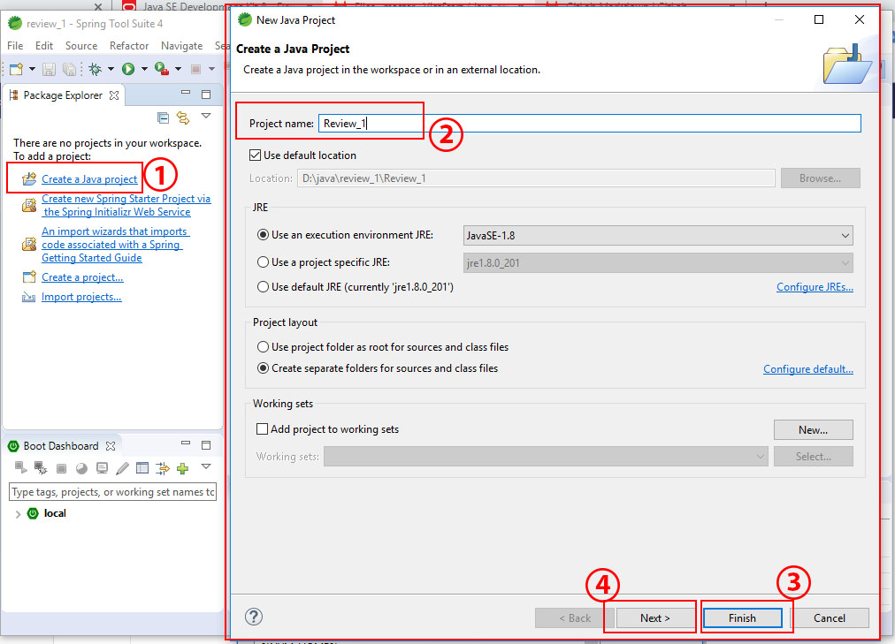

# Overview
<ol>
	<li>[Setup environment](#setup-environment)</li>
	<li>[First application](#first-application)</li>
	<li>[Java syntax](#java-syntax)</li>
	<li>[Java OOP](#java-oop)</li>
	<li>[Java exceptions](#java-exceptions)</li>
	<li>[Java Serialization](#java-serialization)</li>
</ol>

# Setup environment
<!-- ![alt text] -->
 
	__1.__ [__URL: https://www.oracle.com/technetwork/java/javase/downloads/__](https://www.oracle.com/technetwork/java/javase/downloads/jdk8-downloads-2133151.html)
	<ul>
		<li>Cài môi trường cho java cần có jdk theo Url để tải source.</li>
		<li>Chọn Accept License Agreement và phiên bản cần gài.</li>
		<li>jdk-8u221-windows-i586.exe bản cài cho window 32 bit.</li>
		<li>jdk-8u221-windows-x64.exe bản cài cho window 32 bit.</li>
	</ul>
 
	 __2. Sau khi cài đặt xong:__
	<ul>
  		<li>Chúng ta sẽ có được thư mục cài đặt như hình trên.</li>
  		<li>Cần phải cài đặt environment variable cho java</li>
	</ul>
 
	__3. Cài PATH cho java:__
	<ul>
  		<li>Chọn This PC <small>[click chuột phải]</small> chọn Properties</li>
  		<li>Tại màn hình System chọn Advanced system setting sẽ chuyển qua màn hình như hình bên dưới là màn hình System properties</li>
	</ul>
 
	__4. Cài PATH cho java:__
	<ul>
	   <li>Tại màn hình System properties (1) chọn Environment variables (2) sẽ chuyển qua màn hình Environment variables (3)</li>
  	   <li>Tại màn hình Environment variables (3) <small>[Click đôi]</small> vào vị trí Path (4) sễ chuyển qua màn hình Edit</li>
	</ul>
 
	__5. Cài PATH cho java:__
	<ul>
		<li>Tại màn hình Edit environment variables (1) chọn New (2)</li>
		<li>Nhập path của thư mục java (3) như hình chọn Ok</li>
	</ul>
	<i>
		Như vậy là đã cài đặt môi trường cho Java thành công 
		Để test dùng Cmd gõ: __java -version__
	</i>
 
	__6. Cài Tool để viết Java:__
	[https://spring.io/tools]("https://spring.io/tools") 
	<ul>
		<li>Theo Url trên để đến trang tải tool về làm việc với java</li>
		<li>Chọn bản cải đặt thích hợp <i>(chọn bản window 64-bit)</i></li>
	</ul>
	<i>Cài đặt như app bình thường.</i>
## First application
 
	<h4>1. Sau khi cài Tool và chạy sẽ hiện ra màn hình bên trên</h4>

## Java syntax

## Java OOP

## Java exceptions

## Java Serialization
