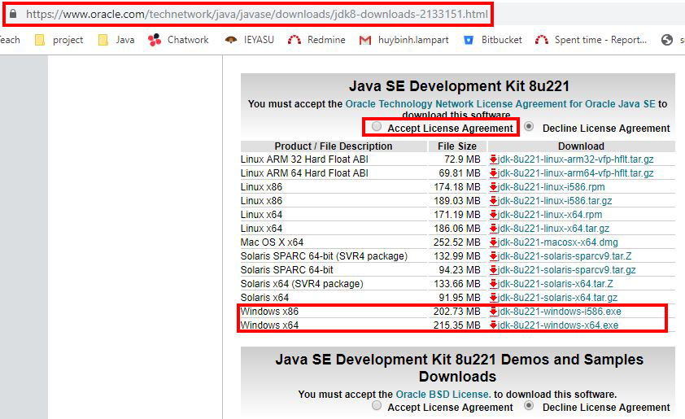
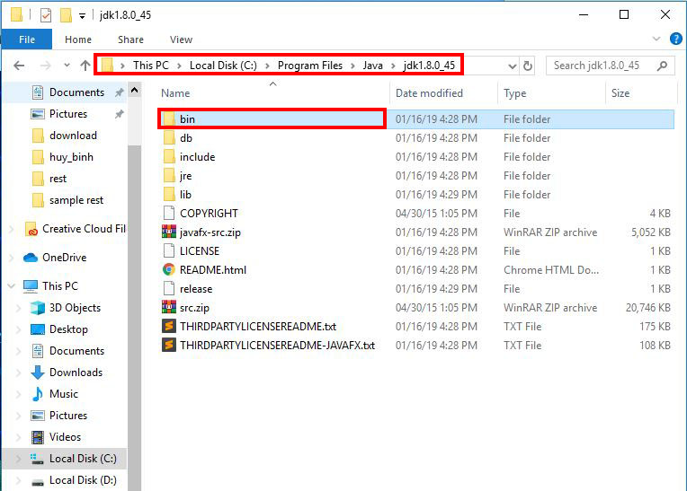
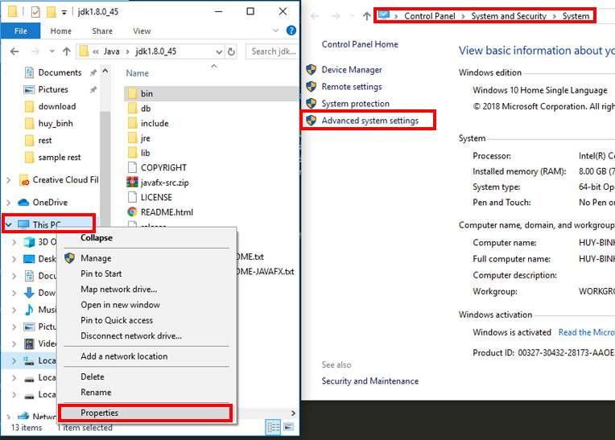
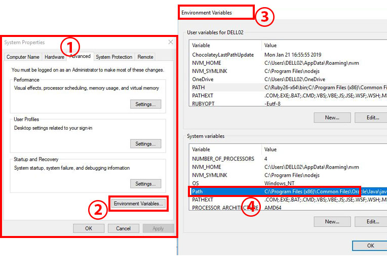
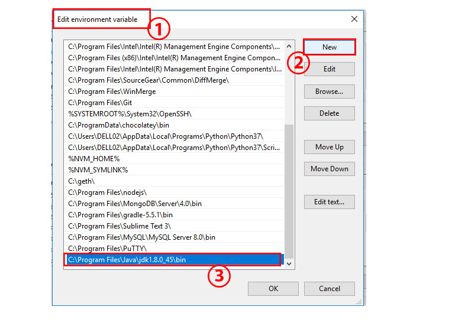
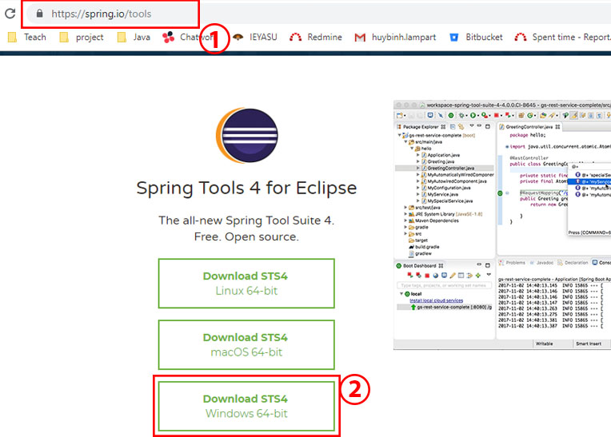

# Overview
*	[Setup environment](#markdown-header-setup-environment)
*	[Import application](#markdown-header-import-application)
*	[Application flow](#markdown-header-application-flow)
*	[Java OOP](#markdown-header-java-oop)
*	[Generic types](#markdown-header-generic-types)
*	[Java Lambda](#markdown-header-Java-Lambda)
*	[Java exceptions](#markdown-header-java-exceptions)
*	[Java Serialization](#markdown-header-java-serialization)
*	[About of annotation](#markdown-header-about-of-annotation)


# Setup environment


*	__[URL: https://www.oracle.com/technetwork/java/javase/downloads/](https://www.oracle.com/technetwork/java/javase/downloads/jdk8-downloads-2133151.html)__
	+	Install environment for java required jdk, Url in above is link source.
	+	Click Accept License Agreement and choose version to install .
	+	jdk-8u221-windows-i586.exe for 32 bit window.
	+	jdk-8u221-windows-x64.exe for 64 bit window.



*	__After install jdk:__
	+	We will have above picture after installed jdk.
	+	We must be install environment variable for java



*	__Installation of environment variable for java:__
	+	On __This PC__ *[right click]* select __Properties__
	+	On __System__ tab select __Advanced system setting__ we will get __System properties__ tab as below picture



*	__Installation of environment variable for java:__
	+	On __System properties__ tab (1) select __Environment variables__ (2) we will get __Environment variables__ tab (3)
	+	On __Environment variables__ tab (3) *[double click]* at Path (4) we will get __Edit__ tab



*	__Installation of environment variable for java:__
	+	On __Edit environment variables__ tab (1) select __New__ (2)
	+	Enter java folder path which you just installed (3) as above picture then click __Ok__
	+	_Ok we just finish to install Java environment_
	+	_Test again, we using Cmd and type:_ __java -version__



*	__Installation of Tool for working with Java:__

	[https://spring.io/tools]("https://spring.io/tools")

	+	Click above Url to download tool for java
	+	Select correctly install source 

-	_(select window 64-bit)_
-	_Install application like normally application._

# Import application

git clone https://Lampart_Thai_Huy_Binh@bitbucket.org/Lampart_Thai_Huy_Binh/java_core.git pwater

+		Clone git source into __pwater__ folder.
+		Open __Spring tool suite__ select __Import__
+		On __Import projects from Folder or Archire__ tab > select __next__.
+		On __Import source:__ bar click __Directory...__
+		Select *pwater*'s parent folder path which you just extract git url then click Finish.

# App flow


*Right click  on above image then select open image in new tab to view fully image*

# About of annotation

-		Create Annotation:
	+ 	validates/InputValidator.java (6-11)

```
@Retention(RetentionPolicy.RUNTIME)
public @interface InputValidator {
	public String name();
	public int min();
	public int max();
	public String msg();
}
```

-		Use and config for Annotation:
	+	Declare annotation: controller/register.java (28-32)
```
	@InputValidator(name="email", min=6, max=35, msg="The length limit your account should be 6 -36 characters")
    public String userName; 

	@InputValidator(name="password", min=6, max=20, msg="The length limit your password should be 6 -20 characters")
    public String password;
```

-		Using as configuration annotation: 
	+	controller/register.java (60-87)
```
try {
	Field[] fields = Login.class.getFields();
	for(Field field:fields){
		 for(Annotation ann:field.getAnnotations()){
             if (ann instanceof InputValidator){
            	 InputValidator check = (InputValidator)ann;                    	 
            	 if("email".equals(check.name())){
            		 if( userEmail.length()<check.min() || userEmail.length()>check.max() ) {
            			 error.put("email",true);
            			 errorString.put("email",check.msg());
            		 } else {
            			 error.put("email",false);
            		 }
            	 }                   	 
            	 if("password".equals(check.name())){
            		 if( password.length()<check.min() || password.length()>check.max() ) {
            			 error.put("password",true);
            			 errorString.put("password",check.msg());
            		 } else {
            			 error.put("password",false);
            		 }
            	 }
             }
         }
	}
} catch (Exception e) { 
    e.printStackTrace(); 
} 
```

-		deploy configuration's validation:
	+	views/register.java (12-14) (19-21)
```
<c:if test = "${error.email}">
	<small id="emailHelp" class="form-text text-danger">${errorString.email}</small>
</c:if>
```
```
<c:if test = "${error.password}">
	<small id="emailHelp" class="form-text text-danger">${errorString.password}</small>
</c:if>
```

-		Using as presentation annotation: 
	+	validates/InputValidatiorHandle.java (9-33)
	+ 	method Check is AnnotationPresent for validates/InputValidator.java (13)
```
field.isAnnotationPresent(InputValidator.class)
```

-		Use present annotation in application:
	+	controller/login.java (83-88)
```
InputValidatiorHandle validate = new InputValidatiorHandle();
try {
	error = validate.check(this);
} catch (Exception e) {
	e.printStackTrace();
}
```
-		validation of present annotaion:
	+	controller/login.java (89-116)
```
if( error.get("email") != null || error.get("password") != null ) {
	if(rememberAcc != null)request.setAttribute("user",rememberAcc);
	request.setAttribute("error",error);
	doGet(request,response);
}else{
	Gson gson = new Gson();
	String getAcc = user.getAccount();
	UserAcc Account = gson.fromJson(getAcc, UserAcc.class);
	if((Account.email).equals(this.userEmail) && (Account.password).equals(this.password)) {
		HttpSession session = request.getSession();
		session.setAttribute("isLogin", true);
		session.setAttribute("loggedId", Account.email);
		session.setAttribute("loggedGender", Account.gender);
		response.sendRedirect(request.getContextPath() + "/home");
	}else{
		if(!(Account.email).equals(this.userEmail)) {
    		error.put("email","Email not found!");
    	}
    	if(!(Account.password).equals(this.password)) {
    		error.put("password","Invaild password!");
    	}
    	if( error.get("email") != null || error.get("password") != null ) {
        	if(rememberAcc != null)request.setAttribute("user",rememberAcc);
        	request.setAttribute("error",error);
        	doGet(request,response);
    	}
	}
}
```
-		Deploy presentation's validation:
	+	views/login.java (12-14) (19-21)
```
<c:if test = "${error.email}">
	<small id="emailHelp" class="form-text text-danger">${errorString.email}</small>
</c:if>
```
```
<c:if test = "${error.password}">
	<small id="emailHelp" class="form-text text-danger">${errorString.password}</small>
</c:if>
```